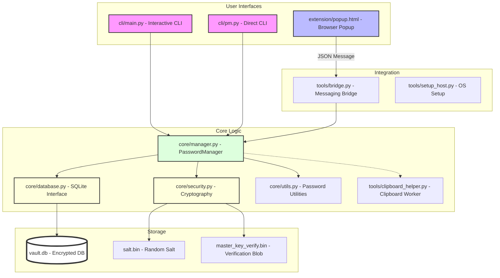

# Secure CLI Password Manager

A robust, local-first command-line interface (CLI) password manager built with Python, focusing on security, simplicity, and cross-platform accessibility.

## Overview

This password manager provides a secure way to store and manage your credentials locally. It features zero-knowledge encryption, meaning your data is encrypted with a key derived from your master password that never leaves your machine.

### Key Features

*   Secure Storage: AES-256-GCM encryption with PBKDF2 key derivation.
*   Dual-Interface CLI: Choose between an interactive menu or direct commands.
*   Browser Integration: Chrome extension for autofilling passwords on the fly.
*   Breach Detection: Integration with "Have I Been Pwned" API to check if your passwords have been leaked.
*   Safety First: Automatic clipboard clearing after 30 seconds to prevent shoulder surfing.
*   Random Generation: Generate cryptographically strong passwords on demand.

## Project Structure

*   `core/`: Cryptography, database, and business logic.
*   `cli/`: Entry points for the interactive and direct command-line interfaces.
*   `tools/`: Browser bridge, clipboard helper, and setup utilities.
*   `extension/`: Browser extension frontend.
*   `tests/`: Unit tests for core components.

## System Architecture

This diagram illustrates the flow of data and interaction between the different components of the system.



### How it Works
1.  Authentication: The Master Password is used with a random salt to derive a 256-bit AES key.
2.  Verification: The system confirms the key is correct by attempting to decrypt a stored verification blob.
3.  Encrypted CRUD: Core manager coordinates with SQLite to store and retrieve blobs encrypted with AES-256-GCM.
4.  Secure Clipboard: When a password is retrieved, a background process wipes the clipboard after 30 seconds.
5.  Native Bridge: The browser extension communicates via standard I/O with the bridge script.

## Installation

1.  Clone the Repository:
    ```bash
    git clone https://github.com/yourusername/password-manager.git
    cd password-manager
    ```

2.  Environment Setup:
    ```bash
    python3 -m venv .venv
    source .venv/bin/activate  # Windows: .venv\Scripts\activate
    pip install -r requirements.txt
    ```

3.  Initial Setup:
    Run the application and follow the prompts to set your master password:
    ```bash
    python3 cli/main.py
    ```

## Usage

### Interactive Mode
```bash
python3 cli/main.py
```

### Direct CLI Mode
```bash
# Get a password for GitHub
python3 cli/pm.py get github

# Add a new entry with a generated password
python3 cli/pm.py add twitter myuser gen20
```

## Testing

The project uses pytest for unit testing the core security and database layers.

```bash
# Run all tests
pytest tests/
```

## Security Model

- KDF: PBKDF2-HMAC-SHA256 with 100,000 iterations and a unique 16-byte salt.
- Encryption: AES-256-GCM ensures both confidentiality and integrity.
- Zero-Knowledge: The master password is never stored; only an encrypted verification blob exists.

## Security Considerations

To ensure your data remains safe, please keep the following in mind:

*   **Master Password Strength**: Your security is only as strong as your master password. Use a long, complex passphrase that you have not used elsewhere.
*   **Physical Security**: If an attacker has physical access to your machine while the vault is "unlocked" or can install a keylogger, they may be able to capture your master password.
*   **Data Integrity**: Do not delete `salt.bin`. This file contains the unique salt used to derive your encryption key. If it is lost, you will be unable to decrypt your database, and your passwords will be unrecoverable.
*   **Local Access**: This manager stores data locally in `vault.db`. Ensure your local user account is password-protected to prevent others with access to your computer from copying your database file.
*   **Extension Security**: Only use the provided extension and bridge scripts. Never give a third-party extension access to your native messaging host.

## License

This project is licensed under the MIT License - see the LICENSE file for details.
